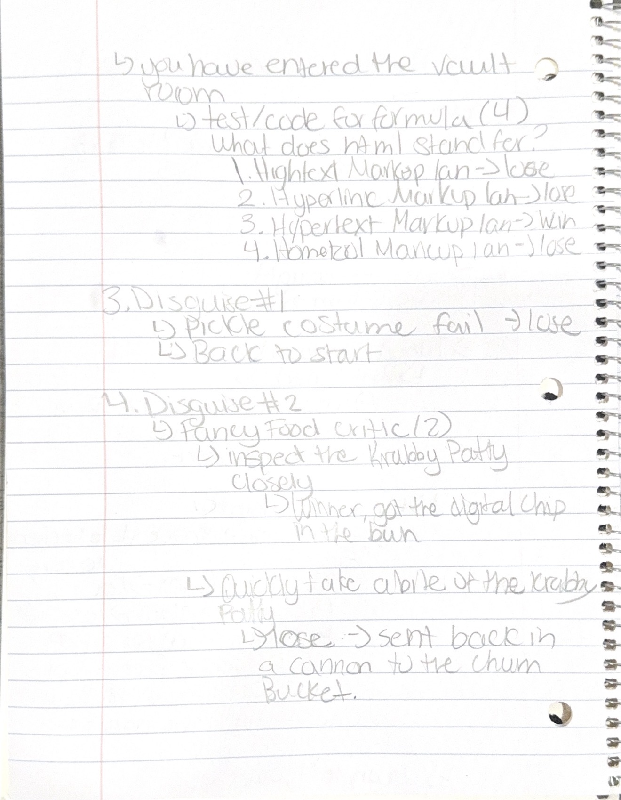
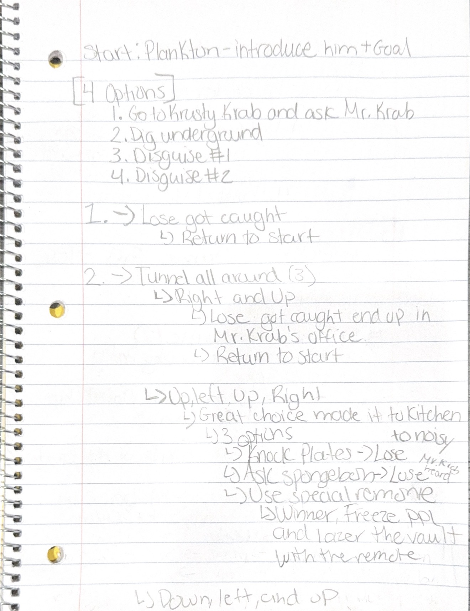

## Inspiration

I wanted to be really creative but have a strong foundation. So I turned to childhood shows, specifically Spongebob Squarepants. This was one show that I grew up watching that I liked. This show was the strong foundation that I needed. If you are not familiar with the show, there is a character named Plankton who owns a restaurant but doesn't have great business and its competitor The Krusty Krab that is across the street is really successful. One of the main focus of the show is Plankton trying to get the secret formula from Mr.Krab so that he can put Mr.Krab out of business and bring the revenue to his business. 

This gave me a strong foundation to build from because it already had a storyline which I can edit to my liking, a great colorful color palette and a distinct character relationships. The storyline really was where I could dive into my creative juices. Plankton is already creative in planning and executing plans to steal the formula so I was trying to embrace and think like him when choosing a plan. 

For the aesthetic I mainly focused on the colors of the sky in the show:

I did also watch a youtube video to remind myself how extreme Plankton thinks of a plan to try to come up with new possibilities of getting the formula BUT at the same time thinking about how Mr.Krab will catch Plankton.
- https://www.youtube.com/watch?v=KVSrZcQfgfA 

## Sketches

## Technical Process

This process was quite challenging and time consuming. I felt really good with HTML but when it came to CSS and styling my pages, it was hard. I am just now getting the hand of what `
` and `class` are AND the relationship between the HTML page and the style sheet. I personally would need to practice CSS a bit more.

One challenge I encountered was uploading and displaying images correctly. Initially, I used the `` tag, but the image would not appear because the file path was incorrect. After experimenting, I remembered that I needed to specify the correct folder location using a forward slash (/) in the file path.

Another issue was centering images on the page. Since images are inline elements by default, I changed their display property to block and used margin settings to center them properly. This gave me trouble as well since I had to play with margin-left,margin-right or just margin, but in the end it worked out.

A specific example that I could not figure out was how to center the image that had a `
` because I already had a styling for all images `.img`. Now that I am thinking with a clear mind it could be something with the parent and child elements that is not allowing them to be center. OR another reason could be that one has a `display: block;` and the other has `display: inline-block;`. 

Finally, I experimented with centering buttons. Because buttons are also inline elements by default, I placed them inside a flex container and used Flexbox properties to align them in the center of the page. This approach became part of my final design because it provided a reliable and consistent way to position elements. I did want to have them centered horizontally but I could not figure out the coding so I satisfied my desire by having the buttons centered and just accpeting the buttons to be stacked vertically.

## References

- Class notes
- https://developer.mozilla.org/en-US/docs/Web/CSS/Reference/Values/gradient/linear-gradient
- https://developer.mozilla.org/en-US/docs/Web/CSS/Reference/Properties/font-family
- https://developer.mozilla.org/en-US/docs/Web/CSS/Reference/Properties/text-align
- https://developer.mozilla.org/en-US/docs/Web/CSS/Reference/Properties/font-weight
- https://www.youtube.com/watch?v=5-r6qhixNMo

