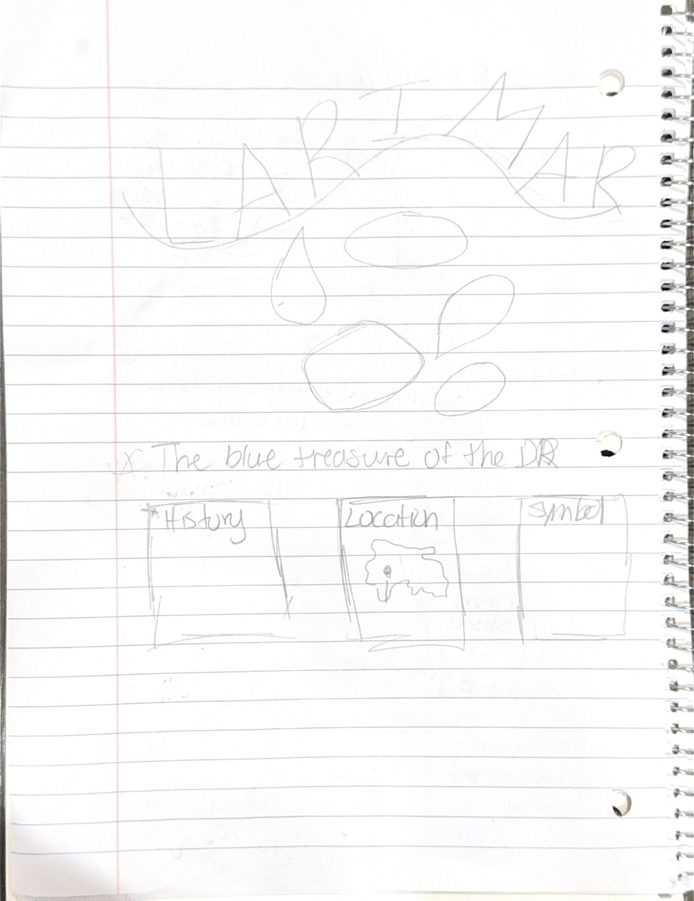
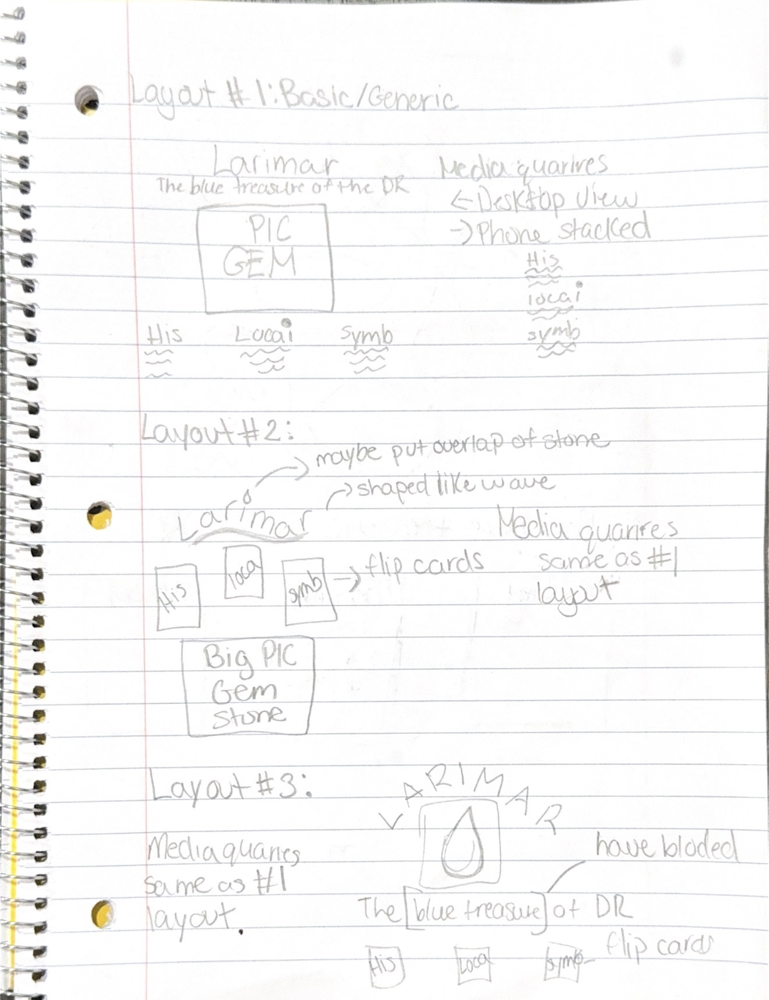
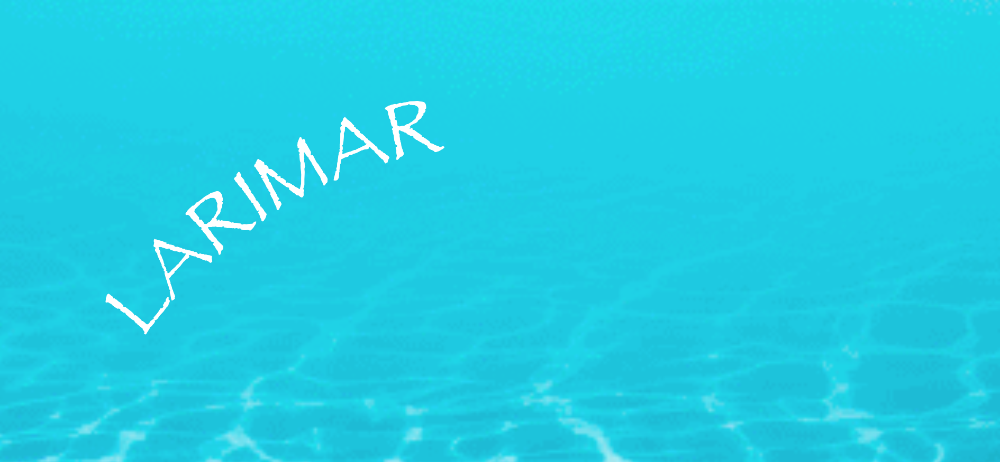
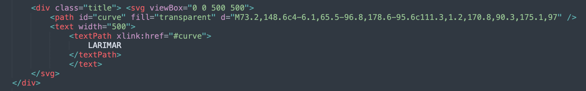

## Inspiration

When trying to choose a topic for this project, I had to really reflect on my own life and decide which place I wanted to focus on. Since I have lived in three different countries, I spent time brainstorming meaningful locations and experiences for me from each one before narrowing down my ideas. My final two concepts were creating a poster about Washington Heights and the strong Dominican culture that exists there, or focusing on a region in the Dominican Republic that is home to Larimar, a rare gemstone found nowhere else in the world.

Ultimately, I chose Larimar because I felt it would be more impactful to focus on one unique aspect of the Dominican Republic rather than a broader topic. Since the Dominican Republic is where I am from, Larimar felt like a meaningful way to celebrate my culture and highlight something that many people may not know about. I was also drawn to the topic because it naturally suggested a visual direction. The gemstone's shades of blue immediately inspired my color palette, while its connection to the Caribbean influenced the calm, ocean-inspired aesthetic of the poster.

As I began designing, I looked at gemstone photography, ocean imagery, and jewelry advertisements featuring Larimar. I searched for keywords such as “Larimar aesthetic" "ocean blue color palette”, "gemstone photography,". I was especially inspired by the vibrant blues, clean layouts, and the contrast between the white patterns in the stone and the deep blue water. Rather than creating a busy webpage, I wanted the design to feel clean, calming, and elegant, allowing the gemstone itself to become the focal point while reflecting the natural beauty of the Dominican Republic.

## Sketches




## Technical Process

The technical process for this project was the most challenging part of the assignment. Going into it, I knew I was not confident using Flexbox, CSS Grid, or media queries. Even during our in-class demonstrations, I found myself following along without fully understanding why certain properties worked the way they did. Because of that, I made the conscious decision to scale back my original design ideas and focus on creating something that met the project requirements while helping me build a stronger understanding of responsive web design.

This was difficult because, creatively, I had many ideas that I wanted to explore. I initially imagined a much more artistic layout with a curved title, floating elements inspired by the shape of Larimar gemstones, and a more experimental composition. However, I realized that before attempting more advanced techniques, I needed to understand the fundamentals. Instead of overwhelming myself, I focused on creating a clean and organized layout that I could confidently explain and build myself.

After sketching my ideas, I went back through my class notes several times and experimented with different Flexbox properties. I also searched for additional tutorials and created my own analogy to understand how Flexbox works. Rather than memorizing code, I started thinking of Flexbox as a way of arranging objects inside a container, where I could control both the horizontal and vertical alignment of the elements.

One of the first concepts that finally "clicked" for me was centering content. I realized that the combination of:
```css
display: flex;
justify-content: center;
align-items: center;
```
became the foundation for much of my layout. Once I understood how these three properties worked together, I found it much easier to position my title, images, and content sections throughout the page.

Another challenge was making my design responsive. Before this project, media queries felt intimidating because I did not understand how to use them. As I continued building my poster, I realized that a media query simply tells the browser to change certain styles when the screen reaches a specific size. This allowed me to change my horizontal Flexbox layout into a vertical one for smaller screens, making the webpage much easier to view on a phone. I also realized that I should not have a fixed width and height on an image in html but rather modify or adjust in CSS to make it more responsive. That moment helped me better understand the purpose of responsive design.

One idea that I experimented with but ultimately decided not to include was creating a wave-shaped title. Since my poster focuses on Larimar and its connection to the Caribbean Sea, I thought a curved title would reinforce the ocean theme. I followed an online tutorial and successfully created the text path, but the curve was much larger than I wanted. I also struggled to control the spacing of the letters along the path, so the title never looked the way I had envisioned. Rather than spending too much time on one feature that I did not fully understand, I decided to simplify the design and focus on creating a polished, functional poster.




Although my final design is simpler than my original vision, I think this project helped me build a much stronger foundation in Flexbox and responsive design. More importantly, I learned that sometimes the best approach is to master the fundamentals first before trying to create more complex layouts. I now feel much more comfortable using Flexbox and have a better understanding of how media queries allow a webpage to adapt across different screen sizes.


## References

- Class notes
- https://css-tricks.com/snippets/css/a-guide-to-flexbox/#css-flexbox-background 
- https://developer.mozilla.org/en-US/docs/Web/CSS/Reference/Properties/font-family
- https://helpx.adobe.com/illustrator/desktop/use-generative-ai/remove-background-from-images.html
- https://www.w3schools.com/css/css_text_spacing.asp
- https://www.w3schools.com/css/css_border.asp
- https://css-tricks.com/snippets/svg/curved-text-along-path/#the-snippet


