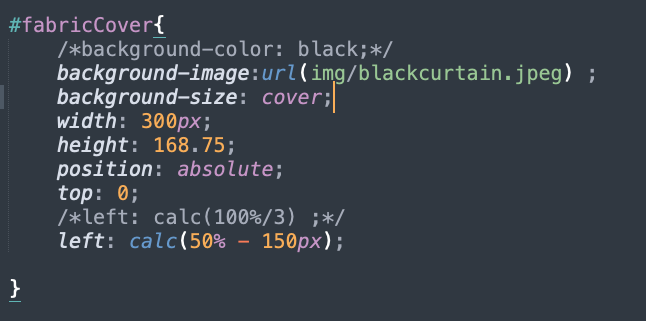
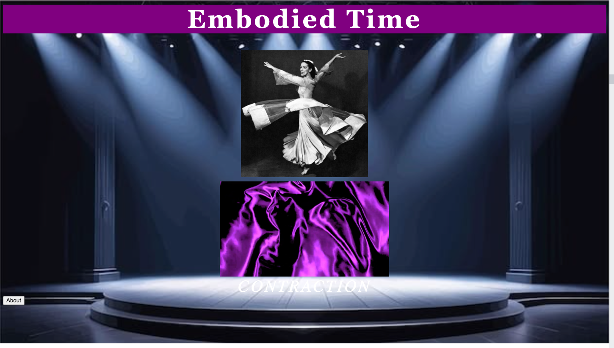
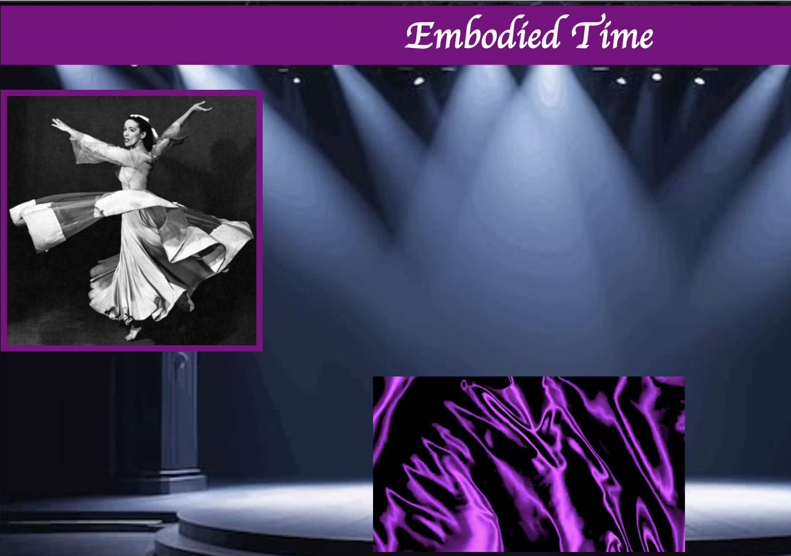
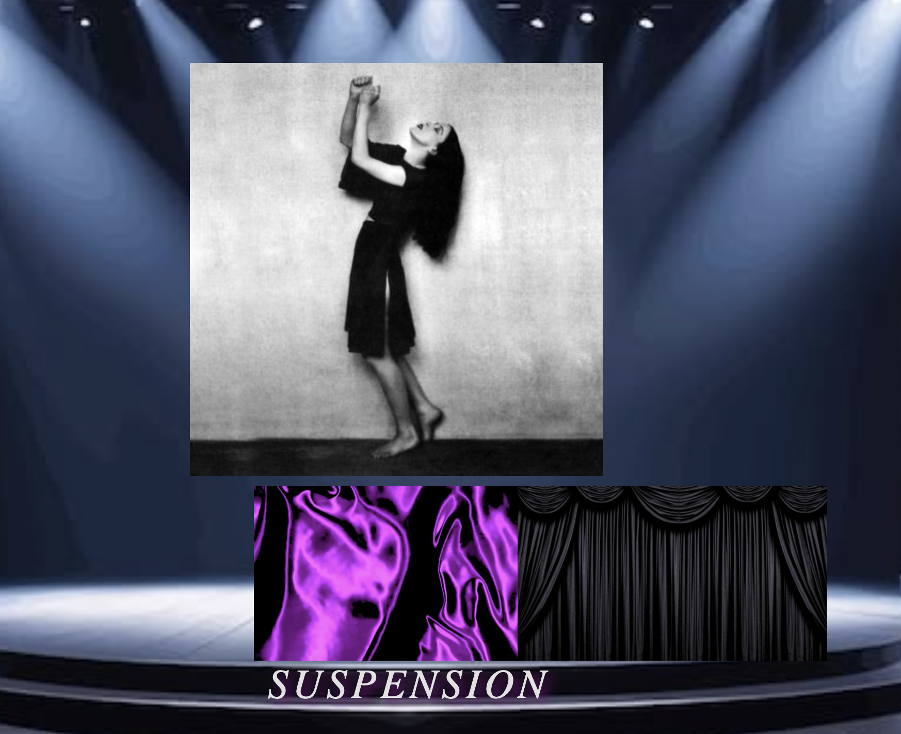

## Inspiration

When we were first introduced to this project, I knew I did not want to create a traditional clock. I wanted to make something that reflected one of my biggest passions which is dance. Before deciding on my final concept, I brainstormed several ideas, including a domino-inspired clock, a hip-hop clock, and even a ballet barre clock. Although I liked aspects of each idea, I kept coming back to Martha Graham because of how much I admire her work and the way she communicates emotion through movement.

My biggest inspiration was the Martha Graham Dance Company and their collection of nineteen signature poses. I was fascinated by the idea that the body itself could become a way of measuring time. Instead of using numbers, I wanted each hour to be represented by a different pose, allowing viewers to read time through movement rather than digits on a clock. As I continued developing the concept, I wanted every part of the clock to reference Graham's choreography. I incorporated the purple fabric as a reference to her iconic solo Lamentation and included movement vocabulary such as Contraction, Release, Spiral, Fall, Recovery, and Suspension to reflect the language of her technique. These elements helped transform the clock from a functional object into something that felt more like a performance.

When researching the visual style of my project I searched for keywords such as Martha Graham, modern dance, proscenium stage, theater lighting, Lamentation, dance performance, and Playbill design. I wanted the website to feel like stepping into a theater, where the clock itself became the performance and the About page resembled a Playbill handed to the audience before the show. Rather than focusing on a highly decorative aesthetic, I chose a minimal color palette of black, white, cream, and purple. These colors allowed the movement and imagery to remain the focus while also referencing the dramatic atmosphere of a theater and the purple fabric from Lamentation.

## Sketches


## Technical Process

This project was definitely a PROCESS and a learning experience. When I first began building this project, I focused on getting all of my assets organized before writing any coding. I collected my stage background, the twelve Martha Graham poses, the purple fabric video, and started laying everything out with HTML and CSS. At first, my goal was simply to recreate the visual composition I had imagined in my proposal before making any of the elements interactive.

The most challenging thing I experimented with was representing the minutes through the purple fabric. My original idea was for a black overlay to gradually slide across the fabric throughout the hour, revealing more of it as time passed. I spent a long time experimenting with the position of a covering `<div>` and updating its location with JavaScript every second. Although I was able to make the overlay move, getting it to accurately represent sixty minutes while staying aligned with the video became much more complicated than I had expected since I used a calculation for its position. After discussing it with my professor during office hours, I decided to simplify this interaction so I could focus on refining the rest of the project. Even though I changed my approach, the process taught me a lot about positioning elements with CSS and manipulating them through JavaScript.


One unexpected challenge involved the movement vocabulary words. I wanted Contraction, Release, Spiral, Fall, Recovery, and Suspension to appear around the stage while fading in and out. At first, I used a single `<div>` that changed its text and position every ten seconds usinf If statements. However, the animation looked jittery because the word was changing while the fade animation was still running. After experimenting with different solutions, I created a separate `<div>` for each word and used JavaScript's `classList.add()` and `classList.remove()` to trigger the fade animation. This created a much smoother transition and gave me better control over the placement of each word.

```
word.classList.add("showWord");
word.classList.remove("showWord");
```

Throughout the project, I also experimented with page layout, typography, and spacing. I adjusted the placement of the dancer, fabric, and movement vocabulary several times before finding a composition that felt balanced on the stage. For the About page, I originally planned a standard informational layout, but later redesigned it to resemble a theatrical Playbill. This decision connected the About page with the performance theme of the clock and helped create a more cohesive experience.

Here were some attempts of layout and design that did not make the cut

Above, I was debating if I should have the purple background but in the end I decided not to keep it because it was to distracting.

Above, I was seeing how the pose would look like with a border. I like how it looked but the problem at that moment was it was center anymore. Pior to the code, it had a display of flex and all the other syntax to center the image but once I put the border it overide the display of flex. 

Above, in my ideal world, I would have wanted a div that would be transparent so that you don't see the "square" moving but rather just see the purple fabric reveal "out of nowhere" type of thing. In this screenshot, I tried a curtain to stay in the dance world but it was too much.

Looking back, I realized that much of the technical process involved simplifying ideas that were initially too ambitious. Instead of trying to implement every feature I imagined, I focused on making the interactions I did include work well. That decision allowed me to create a project that was both functional and true to my original concept of experiencing time through movement rather than numbers.


## References
- Class notes and demos
- https://www.youtube.com/watch?v=YEmdHbQBCSQ
- https://developer.mozilla.org/en-US/docs/Web/CSS/Reference/Properties/font-family
- https://developer.mozilla.org/en-US/docs/Web/CSS/Reference/Properties/text-transform
- https://www.w3schools.com/js/js_operators.asp
- https://developer.mozilla.org/en-US/docs/Web/CSS/Guides/Animations/Using 
- https://developer.mozilla.org/en-US/docs/Web/CSS/Reference/At-rules/@keyframes
- https://developer.mozilla.org/en-US/docs/Web/CSS/Reference/Properties/text-shadow
- https://developer.mozilla.org/en-US/docs/Web/CSS/Reference/Properties/margin
- https://developer.mozilla.org/en-US/docs/Web/CSS/Reference/Properties/letter-spacing
- https://developer.mozilla.org/en-US/docs/Web/CSS/Reference/Properties/font-style
- https://developer.mozilla.org/en-US/docs/Web/CSS/Reference/Properties/border
