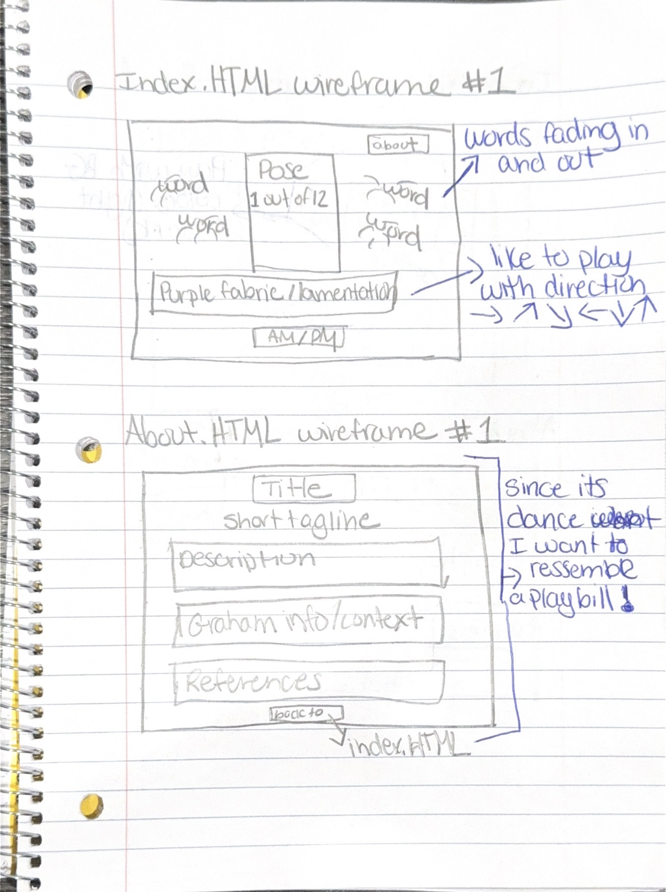
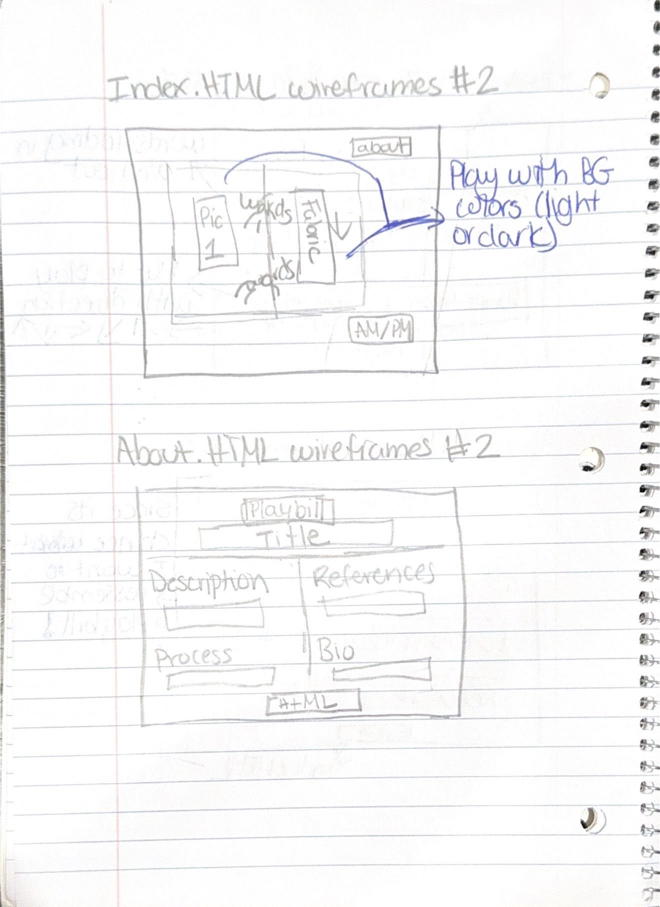
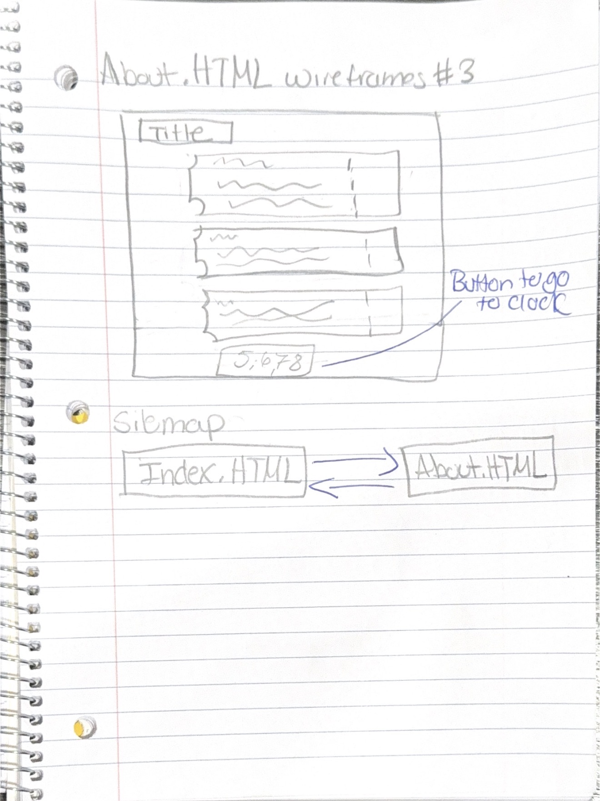

## Description

The clock that I want to create reimagines the traditional clock through the language of dance, specifically inspired by Martha Graham’s movement technique. Instead of using numbers to represent time, the clock will use the body, as a way to show the passing of time. Each hour is marked by one of Graham's nineteen signature positions, centered on a proscenium stage background or open dance studio background. Minutes will be represented by a length of a purple fabric, which is a direct reference to Graham's well known Lamentation dance, that gradually stretches across the stage as the hour progresses, resetting at the top of each hour, where the pose changes discretely, the fabric changes continuously, giving the piece two distinct rhythms of time within a single hour. A third layer of the clock will incorporate words connected to Martha Graham’s technique, such as contraction, release, spiral, fall, recovery, and suspension. These words will continuously fade in and out, creating a visual rhythm that reflects the breath, emotion, and physicality that are central to Graham’s approach to movement.Morning and evening are marked simply and directly with a visible AM/PM label, keeping the piece legible even as its other elements work more abstractly. Rather than telling you the time outright, the piece asks you to read it through gesture, fabric, and language the way an audience learns to read meaning into a body on stage.

## Sketches 

## References 

- https://marthagraham.org/19poses/
- https://my-wall-clock.com/products/original-pole-dance-clock?srsltid=AfmBOorUayacf_sI6cxrKCypVu2SKPNyACyB5p9rvEP7qxB_Ksc03cLN
- https://www.thebonniergallery.com/artworks/268-yucef-merhi-the-poetic-clock-2.0-2000/
- https://www.youtube.com/watch?v=x-7Mo3cg9jw
- https://www.fortvega.com/
- https://www.cinetica.studio/

